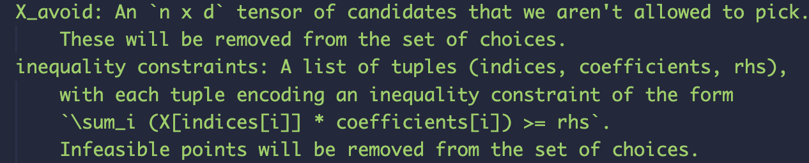

# Reaction OPT

## Propose

建立一个多目标的反应预测框架

- 基于Botorch & Ax: https://github.com/facebook/Ax
- 需要自定义的内容：
  - 初始化筛选
  - 描述符处理
  - yield & ee处理
  - ...?

## plan

### 短期

- [x] 基本完善pipeline，从初始化到自动读取/输出文件
- [x] 反应空间构建效率优化
- [x] 模型迁移至GPU

### 中期

- [ ] 开发其他算法：代理模型和获取函数

        代理函数：GP, RF, NN, GNN?
        获取函数：EHVI，UCB，Utopia Point..?
        其他算法：各种启发式学习，模拟退火，进化算法等

- [ ] 找已发表高通量数据集测试：ee+yield
- [ ] 模型优化的结果自动化可视化：聚类方法，基于分子的拓扑信息？
- [ ] 正交试验：可解释性lime（局部空间）
- [ ] 推进张金旗的自由基烷基化反应和程亮的三组分反应

### 远期

- [ ] 空间的自动化缩减？
- [ ] 反应空间缩减后，如何利用空间外的信息

    可能的解决方案：选点限制
      

- [ ] 迁移学习问题：如何解决反应底物更换的问题
- [ ] 多目标权重标定
- [ ] 考虑产率/ee值的误差问题；
- [ ] 重启算法，什么时候应该放弃现有搜索结果？
- [ ] 
- [ ] 更大的高通量数据集？(10^5~10^6级别？)
