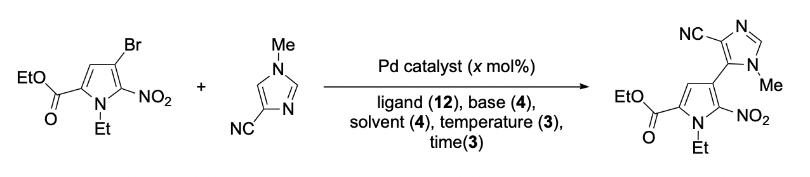
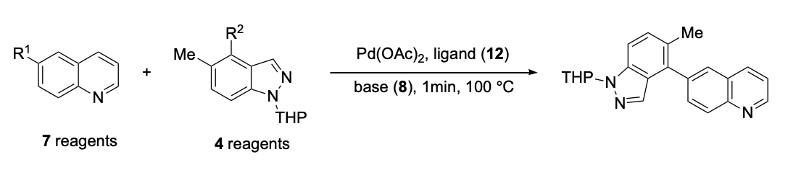
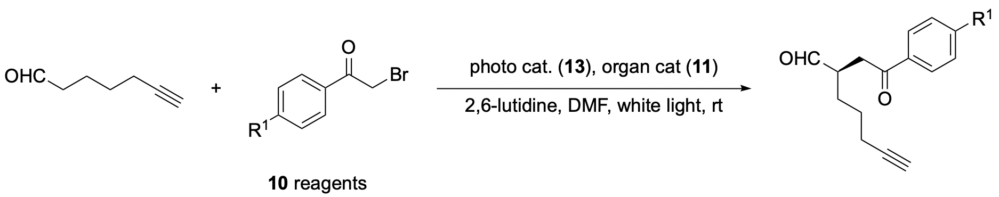
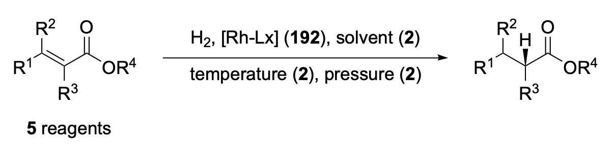
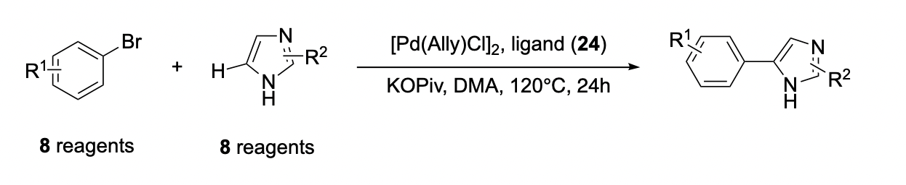
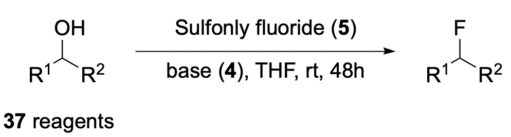
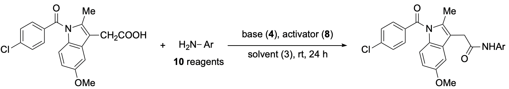

# Dataset Information

## Buchwald-Hartwig reaction HTE dataset

- paper: Torres, J. A. G.; Lau, S. H.; Anchuri, P.; Stevens, J. M.; Tabora, J. E.; Li, J.; Borovika, A.; Adams, R. P.; Doyle, A. G. A Multi-Objective Active Learning Platform and Web App for Reaction Optimization. J. Am. Chem. Soc. 2022, 144 (43), 19999–20007. https://doi.org/10.1021/jacs.2c08592.

- dataset information

| feature           | value                                                  |
|-------------------|--------------------------------------------------------|
| dataset size      | 1728                                                   |
| reagent type      | base, ligand, solvent, concentration, temperature      |
| exp data coverage | 100.0%                                                 |
| target type       | yield, cost                                             |

- mark: have their calculated QM descriptor

## Suzuki reaction HTE dataset

- paper: Perera, D.; Tucker, J. W.; Brahmbhatt, S.; Helal, C. J.; Chong, A.; Farrell, W.; Richardson, P.; Sach, N. W. A Platform for Automated Nanomole-Scale Reaction Screening and Micromole-Scale Synthesis in Flow. Science 2018, 359 (6374), 429–434. https://doi.org/10.1126/science.aap9112.

- dataset information

| feature           | value                                      |
|-------------------|--------------------------------------------|
| dataset size      | 5760                                       |
| reagent type      | solvent, ligand, reactant1, reactant2, base |
| exp data coverage | 53.6%                                      |
| target type       | conversion                                 |

## α-asymmetric alkylation of aldehyde with photocatalyst

- paper: Nie, W.; Wan, Q.; Sun, J.; Chen, M.; Gao, M.; Chen, S. Ultra-High-Throughput Mapping of the Chemical Space of Asymmetric Catalysis Enables Accelerated Reaction Discovery. Nat. Commun. 2023, 14 (1), 1–11. https://doi.org/10.1038/s41467-023-42446-5.

- dataset information

| feature           | value                                      |
|-------------------|--------------------------------------------|
| dataset size      | 1430                                       |
| reagent type      | reaction1, reaction2, catalyst1, Catalyst2 |
| exp data coverage | 100.0%                                     |
| target type       | ee, yield                                  |

## Asymmetric hydrogenation of alkene

- paper: Kalikadien, A. V.; Valsecchi, C.; Putten, R. van; Maes, T.; Muuronen, M.; Dyubankova, N.; Lefort, L.; Pidko, E. A. Probing Machine Learning Models Based on High Throughput Experimentation Data for the Discovery of Asymmetric Hydrogenation Catalysts. Chem. Sci. 2024, 15 (34), 13618–13630. https://doi.org/10.1039/D4SC03647F.

- dataset information

| feature               | value                                                                 |
|-----------------------|-----------------------------------------------------------------------|
| dataset size          | 3168                                                                  |
| reagent type          | reagent, solvent, ligand, metal_amount, ligand_amount, temperature, pressure, time |
| exp data coverage     | 10.3%                                                                 |
| target type           | ee, conversion                                                         |

## C-H arylation reaction HTE dataset

- paper: Wang, J. Y.; Stevens, J. M.; Kariofillis, S. K.; Tom, M.-J.; Golden, D. L.; Li, J.; Tabora, J. E.; Parasram, M.; Shields, B. J.; Primer, D. N.; Hao, B.; Del Valle, D.; DiSomma, S.; Furman, A.; Zipp, G. G.; Melnikov, S.; Paulson, J.; Doyle, A. G. Identifying General Reaction Conditions by Bandit Optimization. Nature 2024, 626 (8001), 1025–1033. https://doi.org/10.1038/s41586-024-07021-y.

- dataset information

| feature               | value                                                                 |
|-----------------------|-----------------------------------------------------------------------|
| dataset size          | 1536                                                                  |
| reagent type          | ligand,electrophile,nucleophile                                       |
| exp data coverage     | 100.0%                                                                 |
| target type           | yield                                                         |

## Deoxyfluorination reaction HTE dataset

- paper: Nielsen, M. K.; Ahneman, D. T.; Riera, O.; Doyle, A. G. Deoxyfluorination with Sulfonyl Fluorides: Navigating Reaction Space with Machine Learning. J. Am. Chem. Soc. 2018, 140 (15), 5004–5008. https://doi.org/10.1021/jacs.8b01523.

- dataset information

| feature               | value                                                                 |
|-----------------------|-----------------------------------------------------------------------|
| dataset size          | 740                                                                   |
| reagent type          | base,fluoride,substrate                                               |
| exp data coverage     | 100.0%                                                                |
| target type           | yield                                                                 |

## Amide coupling reaction HTE dataset

- paper: Wang, J. Y.; Stevens, J. M.; Kariofillis, S. K.; Tom, M.-J.; Golden, D. L.; Li, J.; Tabora, J. E.; Parasram, M.; Shields, B. J.; Primer, D. N.; Hao, B.; Del Valle, D.; DiSomma, S.; Furman, A.; Zipp, G. G.; Melnikov, S.; Paulson, J.; Doyle, A. G. Identifying General Reaction Conditions by Bandit Optimization. Nature 2024, 626 (8001), 1025–1033. https://doi.org/10.1038/s41586-024-07021-y.

- dataset information

| feature               | value                                                                 |
|-----------------------|-----------------------------------------------------------------------|
| dataset size          | 960                                                                   |
| reagent type          | solvent,base,activator,nucleophile                            |
| exp data coverage     | 100.0%                                                                |
| target type           | yield                                                                 |

